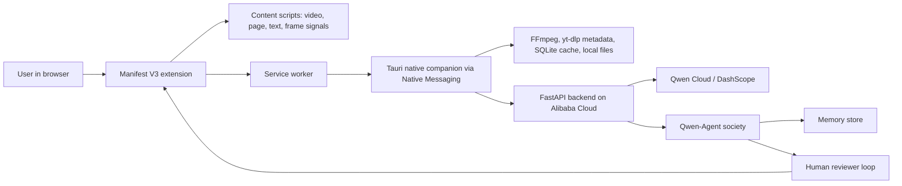

# DescribeOps

DescribeOps is a Qwen Cloud powered accessibility browser agent for video and web content. It detects inaccessible media where users already work, sends authorized context through a local companion and Alibaba Cloud backend, and produces audio descriptions, captions, review queues, playback packages, and accessibility reports.

Primary Qwen hackathon track: **Track 4, Autopilot Agent**. Secondary tracks: **Track 3, Agent Society**, **Track 1, MemoryAgent**, and **Track 5, EdgeAgent**.

## Repository Layout

- `apps/extension` - Chromium Manifest V3 extension with popup, side panel, service worker, content detection, and native messaging bridge.
- `apps/desktop-companion` - Tauri desktop companion and native messaging host for local tools, cache, queueing, and media import.
- `services/api` - FastAPI backend, Alibaba Cloud deployment scaffold, Qwen Cloud/DashScope gateway, job APIs, upload limits, and evidence packaging.
- `services/agent-core` - Qwen-Agent-oriented specialist agent society for AD writing, QA, reviewer routing, publishing, and baseline benchmarks.
- `packages/shared` - Shared schemas, event contracts, and accessibility artifact types.
- `docs/architecture` - Architecture, hackathon alignment, compliance, permissions, and threat model.
- `docs/demo` - Three-minute demo script and submission narrative.

## Local Setup

Prerequisites:

- Node.js 24+ and npm 11+.
- Rust 1.94+ and Cargo.
- Chromium or Chrome for unpacked extension testing.
- FFmpeg on `PATH` for media probing. Missing FFmpeg is detected by the companion health check.
- Linux Tauri desktop builds also need WebKitGTK and related system packages for your distro. On Debian/Ubuntu, install at least:

```bash
sudo apt-get install -y libglib2.0-dev libgtk-3-dev libwebkit2gtk-4.1-dev libayatana-appindicator3-dev librsvg2-dev patchelf
```

Install and verify:

```bash
npm install
npm run build
npm run test
npm run test:rust
npm run test:python
```

Windows users working in WSL should run Node/npm inside WSL or from a native Windows checkout. Windows npm can fail when installing symlinked workspaces over a UNC WSL path.

## Local Desktop Installation

DescribeOps installs locally as a Chromium extension plus a desktop companion/native host. The extension is the browser surface; the companion is the installable desktop process that exposes local media tools, SQLite cache, weak-network queueing, and Chrome Native Messaging.

1. Build the browser extension:

```bash
npm --prefix apps/extension run build
```

2. Open `chrome://extensions`, enable developer mode, choose **Load unpacked**, and select `apps/extension/dist`.

3. Copy the loaded extension ID from `chrome://extensions`.

4. Build the native messaging host:

```bash
cargo build --manifest-path apps/desktop-companion/src-tauri/Cargo.toml --bin describeops-native-host
```

5. Register the host for Chrome on Linux:

```bash
apps/desktop-companion/scripts/register-native-host.sh \
  apps/desktop-companion/src-tauri/target/debug/describeops-native-host \
  <chrome-extension-id> \
  chrome
```

Use `chromium` as the final argument if you loaded the extension in Chromium instead of Google Chrome.

6. Register the host for Chrome on Windows PowerShell:

```powershell
apps\desktop-companion\scripts\register-native-host.ps1 `
  -HostPath apps\desktop-companion\src-tauri\target\debug\describeops-native-host.exe `
  -ExtensionId <chrome-extension-id>
```

7. Restart Chrome, open the DescribeOps side panel, and choose **Check companion**. A healthy install returns the companion version, storage path, supported tools, SQLite availability, and FFmpeg status.

To build the full desktop companion installer/shell for local testing after installing the platform Tauri prerequisites:

```bash
npm --prefix apps/desktop-companion run build
```

Release bundles are written under `apps/desktop-companion/src-tauri/target/release/bundle` when the platform Tauri prerequisites are installed.

### Windows installer from WSL

Tauri v2's supported Windows installer path runs the Tauri build on a Windows computer. From WSL, use the helper to delegate the build to Windows PowerShell:

```bash
scripts/build-windows-installer-from-wsl.sh
```

This still requires the Windows-side prerequisites: Node.js, Rust MSVC, Microsoft C++ Build Tools, WebView2 Runtime, and NSIS for a setup `.exe`. The generated installer appears under:

```text
apps\desktop-companion\src-tauri\target\release\bundle
```

If Windows npm struggles with the repo over a UNC WSL path, copy the repo to a Windows drive such as `C:\dev\describeops` and run the same `npm --prefix apps\desktop-companion run build` command from PowerShell there.

## Deployment And Public Install

- Copy `.env.sample` to your local or cloud environment and keep unprefixed secrets server-side.
- Use `docs/deployment/general-availability.md` as the release checklist.
- Use `docs/deployment/submission-checklist.md` for hackathon submission mapping.
- Publish `docs/install/index.html` as the public install page for extension and companion downloads.
- Upload extension and companion release assets to the release URL configured by `VITE_DESCRIBEOPS_RELEASE_BASE_URL`.

## Extension Developer Load

1. Build the extension with `npm --prefix apps/extension run build`.
2. Open `chrome://extensions`.
3. Enable developer mode.
4. Load unpacked from `apps/extension/dist`.
5. Open a page with video or readable article content and use the DescribeOps action or side panel.

## Native Companion Developer Install

1. Build the native host with `cargo build --manifest-path apps/desktop-companion/src-tauri/Cargo.toml --bin describeops-native-host`.
2. Load the extension and copy its Chrome extension ID.
3. Register with the helper for your platform in `apps/desktop-companion/scripts`.
4. The extension service worker connects to native host `com.describeops.native`.

## Alibaba Cloud Deployment Proof

The FastAPI service and Qwen Cloud gateway live under `services/api`. The submission proof lives at `docs/deployment/alibaba-cloud-proof.md` and includes:

- Alibaba Cloud service used for runtime.
- Qwen Cloud/DashScope configuration proof without secrets.
- Health endpoint output.
- Short deployment recording link.

Run the API locally:

```bash
cp .env.sample .env
# Edit .env and set DESCRIBEOPS_API_TOKEN, DASHSCOPE_API_KEY, and any QWEN_* overrides.
uv run --project services/api uvicorn describeops_api.main:app --reload
curl http://127.0.0.1:8000/health
```

By default, the backend routes reasoning and QA to `qwen-max-latest`, multimodal frame/video/OCR assistance to `qwen3.7-plus`, and summarization to `qwen-plus-latest`. Override `QWEN_*_MODEL` variables only when your DashScope region exposes a different current model catalog.

## Architecture

See `docs/architecture/qwen-hackathon-alignment.md` for track mapping, `docs/architecture/compliance-and-permissions.md` for authorized-content rules, and `docs/architecture/threat-model.md` for security boundaries.



## License

Apache-2.0. See `LICENSE`.
