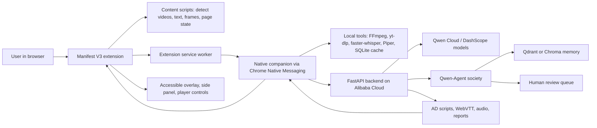

# DescribeOps Qwen Browser Agent Implementation Plan

> **For agentic workers:** REQUIRED SUB-SKILL: Use `superpowers-optimized:subagent-driven-development` or `superpowers-optimized:executing-plans` to implement this plan task-by-task. Steps use checkbox (`- [ ]`) syntax for tracking.

**Goal:** Build DescribeOps as an installable computer browser accessibility agent that uses Qwen Cloud for multimodal, memory-aware, multi-agent video and web accessibility workflows.

**Architecture:** The product ships as a Chromium Manifest V3 extension plus a local native companion app. The extension detects videos and inaccessible page content, overlays accessible playback/review UI, and communicates with the companion through Chrome Native Messaging. The companion handles local media tooling, caching, offline playback assets, and secure calls to a FastAPI backend deployed on Alibaba Cloud. The Qwen Cloud layer powers multimodal frame understanding, agent planning, tool calling, memory retrieval, QA review, and human-in-the-loop routing.

**Tech Stack:** Chromium extension Manifest V3, React + TypeScript, React Aria or Radix UI, Playwright, FastAPI, Python, Qwen-Agent, Qwen Cloud/DashScope APIs, Alibaba Cloud deployment, yt-dlp, FFmpeg, faster-whisper, Tesseract OCR fallback, Qdrant or Chroma, SQLite, Piper TTS, axe-core, Playwright Test, Tauri for the installable native companion.

**Assumptions:**
- Assumes the first shipping target is desktop Chromium browsers through a Manifest V3 extension plus native companion; this will not immediately support Safari, Firefox, iOS, or Android.
- Assumes Qwen Cloud/DashScope credentials and Alibaba Cloud deployment access are available; the cloud agent layer will not run fully without those credentials.
- Assumes all processed media is owned by, licensed to, or explicitly authorized by the user; the system will not bypass DRM, paywalls, login restrictions, or platform access controls.
- Assumes offline mode means cached playback, edits, queueing, and local fallback services; it will not perform full multimodal generation offline in the MVP.

---

## Current Requirements And Source Alignment

Official Qwen Cloud hackathon facts verified on 2026-06-12:

- Deadline: July 9, 2026 at 2:00 PM PDT.
- Required build: use Qwen models available on Qwen Cloud and submit under at least one track.
- Best target tracks for DescribeOps:
  - Track 1, MemoryAgent: persistent memory, preferences, timely forgetting, critical recall in limited context.
  - Track 3, Agent Society: multiple agents with division of labor, dialogue, negotiation, conflict resolution, measurable gain over a single-agent baseline.
  - Track 4, Autopilot Agent: real-world workflow automation, ambiguous inputs, external tools, human checkpoints, production readiness.
  - Track 5, EdgeAgent: edge-cloud orchestration, privacy-aware handling, weak-network degradation.
- Required submission artifacts:
  - Public open-source repository with visible license.
  - Proof that backend runs on Alibaba Cloud, including short recording and repo file demonstrating Alibaba Cloud services/API use.
  - Architecture diagram.
  - Public 3-minute demo video.
  - Text description of features and functionality.
  - Track identification.
- Judging weights:
  - Technical Depth & Engineering: 30%.
  - Innovation & AI Creativity: 30%.
  - Problem Value & Impact: 25%.
  - Presentation & Documentation: 15%.

Documentation checked for stack decisions:

- Qwen Cloud / Alibaba Model Studio supports OpenAI-compatible Chat Completions, OpenAI-compatible Responses, Anthropic-compatible Messages, and native DashScope interfaces.
- Qwen-Agent supports Qwen-based agents with planning, memory, tool use, function calling, MCP, RAG, code interpreter, and browser-style examples.
- Chrome extensions are built with HTML, CSS, and JavaScript; `manifest.json` is required, service workers handle background events, and content scripts run in page context.
- Chrome Web Store policy requires a narrowly defined single purpose and forbids downloading additional JavaScript logic at runtime.
- Chrome Native Messaging lets extensions communicate with native applications through registered stdio hosts; content scripts must message the service worker, which then connects to the native host.
- Playwright can test Chromium extensions only with a persistent context and bundled Chromium.
- Tauri provides small installable desktop binaries using web frontend technology and Rust-backed native capabilities.

## Product Strategy

DescribeOps should be positioned as:

> A Qwen-powered accessibility browser agent that can see, hear, read, describe, simplify, caption, navigate, remember, and review inaccessible video or web content.

The winning wedge is not raw audio-description generation. The wedge is a browser-installed workflow that:

- Detects inaccessible media where users already work.
- Uses Qwen Cloud multimodal reasoning to understand visual context.
- Splits work across specialist agents.
- Remembers reviewer preferences and organization-specific style rules.
- Routes uncertain segments to humans.
- Produces timed AD, captions, WebVTT, QA reports, and offline playback packages.
- Demonstrates graceful weak-network behavior through local caching and queueing.

## Target Architecture

## Phase 1: Repo, License, Architecture, And Submission Scaffold

**Outcome:** A public-ready, open-source repository skeleton that satisfies the hackathon's repository, license, documentation, and architecture artifact expectations from day one.

**Core work:**

- [x] Create a monorepo layout:
  - `apps/extension` for the Manifest V3 browser extension.
  - `apps/desktop-companion` for the Tauri native host and local manager.
  - `services/api` for the FastAPI backend deployed to Alibaba Cloud.
  - `services/agent-core` for Qwen-Agent orchestration.
  - `packages/shared` for schemas, event contracts, and accessibility artifact types.
  - `docs/architecture` for diagrams, threat model, demo script, and submission notes.
- [x] Add an open-source license visible at repo root, preferably Apache-2.0 to align with several Qwen/open-source ecosystem tools.
- [x] Add `README.md` with the product description, target Qwen tracks, local setup, Alibaba deployment proof section, architecture diagram link, and demo instructions.
- [x] Add `docs/architecture/qwen-hackathon-alignment.md` mapping every feature to the four target tracks and judging criteria.
- [x] Add `docs/architecture/compliance-and-permissions.md` stating that DescribeOps only processes authorized content and does not bypass DRM or access controls.
- [x] Add `docs/demo/three-minute-demo-script.md` with a timed demo narrative.

**Verification:**

- [x] `README.md` names Qwen Cloud, target tracks, license, and setup path.
- [x] Root license file exists and is visible.
- [x] Architecture document includes extension, native companion, Alibaba backend, Qwen Cloud, agents, memory, local cache, and reviewer loop.
- [x] Demo script fits within 3 minutes when read aloud.

**Winning criteria covered:** Presentation & Documentation, Technical Depth, Problem Value.

## Phase 2: Installable Browser Surface

**Outcome:** A computer-installable Chromium extension with an accessible side panel, popup, content script, and video/page detector.

**Core work:**

- [x] Build `apps/extension` with Vite, React, TypeScript, and Manifest V3.
- [x] Implement `manifest.json` with:
  - `action` popup for quick status.
  - `side_panel` for task workflow.
  - background service worker.
  - content scripts for video/page detection.
  - minimal host permissions with user-triggered activation where possible.
  - `nativeMessaging` permission for the companion bridge.
- [x] Implement content detection:
  - HTML5 video/audio elements.
  - common embedded players through iframes where browser permissions allow.
  - page title, headings, transcript text, captions, ARIA landmarks, and visible text.
  - canvas-heavy or inaccessible regions flagged as "needs visual sampling".
- [x] Implement accessible UI:
  - keyboard-only operation.
  - screen-reader labels and live regions.
  - side panel tabs for Detect, Generate, Review, Playback, Settings.
  - no color-only state.
- [x] Implement extension event contracts:
  - `PAGE_SCAN_REQUESTED`
  - `PAGE_SCAN_COMPLETED`
  - `MEDIA_CAPTURE_REQUESTED`
  - `AD_JOB_CREATED`
  - `REVIEW_SEGMENT_UPDATED`
  - `PLAYBACK_SYNC_CHANGED`

**Verification:**

- [ ] Load unpacked extension in Chromium.
- [x] Playwright extension test launches persistent Chromium context with extension loaded.
- [x] Test page with an HTML5 video is detected.
- [x] Test page with no video returns a readable accessibility scan.
- [ ] axe-core reports no serious or critical violations in popup and side panel.
- [ ] Keyboard-only smoke test completes detection and opens side panel.

**Winning criteria covered:** Technical Depth, Problem Value, Presentation.

## Phase 3: Native Companion And Local Tool Bridge

**Outcome:** A Tauri desktop companion installs on Windows/macOS/Linux and registers a native messaging host for the extension.

**Core work:**

- [x] Build `apps/desktop-companion` with Tauri.
- [x] Implement native messaging protocol:
  - stdio JSON length-prefixed messages.
  - request/response IDs.
  - strict schema validation.
  - error envelopes with user-safe messages and developer diagnostics.
- [x] Register native host manifests:
  - Windows registry registration helper.
  - macOS user-level manifest path.
  - Linux user-level manifest path.
- [x] Add local capabilities:
  - SQLite job cache.
  - local artifact storage.
  - FFmpeg probe/extract/slice commands.
  - yt-dlp public URL metadata probe only when authorized.
  - local file upload/import.
  - queue manager for weak-network mode.
- [x] Add installer scripts and documented manual developer install path.

**Verification:**

- [ ] Extension service worker connects to native companion.
- [x] Native companion returns health, version, supported tools, and storage path.
- [x] Companion rejects malformed or oversized native messages.
- [x] FFmpeg presence is detected and missing-tool remediation is shown.
- [x] Local file import produces media metadata without uploading content.

**Winning criteria covered:** Technical Depth, EdgeAgent, Production Readiness.

## Phase 4: Alibaba Cloud Backend And Qwen Cloud Gateway

**Outcome:** A FastAPI backend runs on Alibaba Cloud and exposes secure job APIs backed by Qwen Cloud/DashScope.

**Core work:**

- [x] Build `services/api` with FastAPI.
- [x] Add API routes:
  - `POST /v1/jobs` create job.
  - `POST /v1/jobs/{id}/assets` upload authorized samples/artifacts.
  - `POST /v1/jobs/{id}/analyze` start Qwen analysis.
  - `GET /v1/jobs/{id}` status.
  - `GET /v1/jobs/{id}/artifacts` list outputs.
  - `POST /v1/jobs/{id}/review` submit reviewer edits.
  - `POST /v1/memory/preferences` update user/org memory.
- [x] Add Qwen Cloud gateway:
  - OpenAI-compatible API adapter for general text/reasoning calls.
  - DashScope/native adapter for model features not exposed through compatibility APIs.
  - retry, timeout, rate limit, cost tracking, and request tracing.
  - model router for text reasoning, multimodal frame analysis, OCR assistance, QA scoring, and summarization.
- [x] Add Alibaba Cloud deployment:
  - Dockerfile.
  - deployment manifest or Terraform-style infrastructure notes.
  - `docs/deployment/alibaba-cloud-proof.md`.
  - small health endpoint that proves cloud runtime and Qwen config presence without leaking secrets.
- [x] Add secret handling:
  - `DASHSCOPE_API_KEY` or current Qwen Cloud key variable.
  - no client-side Qwen credentials.
  - signed upload URLs or authenticated backend uploads.

**Verification:**

- [ ] Backend runs locally and on Alibaba Cloud.
- [x] `/health` returns service version and cloud deployment marker.
- [ ] Qwen gateway executes a smoke test prompt through Qwen Cloud.
- [x] API rejects missing auth and oversized uploads.
- [x] Deployment proof document links to code that demonstrates Alibaba Cloud/Qwen use.

**Winning criteria covered:** Technical Depth, required Alibaba proof, Production Readiness.

## Phase 5: Media And Page Understanding Pipeline

**Outcome:** DescribeOps converts browser/page/video context into structured evidence for agents.

**Core work:**

- [x] Define shared schemas:
  - `DetectedMedia`
  - `PageAccessibilitySnapshot`
  - `VideoFrameSample`
  - `TranscriptSegment`
  - `SceneObservation`
  - `AudioDescriptionCue`
  - `EvidenceBundle`
- [x] Implement browser snapshot extraction:
  - page metadata.
  - accessibility tree summary where available.
  - visible text and headings.
  - captions/transcript tracks.
  - video timing and dimensions.
  - selected screenshots or frame captures with user consent.
- [x] Implement media preprocessing:
  - FFmpeg scene-change sampling.
  - low-bandwidth fixed-interval sampling mode.
  - audio extraction for transcription.
  - subtitle extraction when available.
  - OCR pass for important on-screen text.
- [x] Implement transcription:
  - faster-whisper local/default where feasible.
  - cloud-assisted fallback or enhancement through Qwen where needed.
  - speech gap detection to avoid AD overlap.
- [x] Implement evidence packaging for Qwen:
  - compact frame batches.
  - transcript windows.
  - page context.
  - user memory/style constraints.
  - explicit uncertainty fields.

**Verification:**

- [x] A sample video produces frame samples, transcript segments, speech-gap windows, OCR observations, and a single evidence bundle.
- [x] A webpage without video produces a page accessibility snapshot.
- [x] Low-bandwidth mode reduces frame volume while preserving representative scene coverage.
- [x] Evidence bundle excludes secrets, cookies, and unneeded personal data.

**Winning criteria covered:** Technical Depth, Innovation, EdgeAgent.

## Phase 6: Qwen Agent Society

**Outcome:** A multi-agent Qwen system generates, critiques, and finalizes accessible outputs with measurable advantage over a single-agent baseline.

**Core work:**

- [x] Build `services/agent-core` around Qwen-Agent.
- [x] Implement specialist agents:
  - Intake Agent: classifies job type, permissions, and processing route.
  - Scene Analyst Agent: uses Qwen multimodal capabilities to describe key visual changes.
  - Transcript Alignment Agent: aligns visual descriptions with speech gaps.
  - Description Writer Agent: writes concise timed AD cues.
  - Accessibility QA Agent: checks hallucination risk, missed on-screen text, timing overlap, and WCAG-style usability issues.
  - Reviewer Routing Agent: decides which cues require human review.
  - Memory Agent: retrieves and updates user/org style preferences and prior corrections.
  - Publisher Agent: emits WebVTT, JSON, audio script, compliance summary, and player package.
- [x] Implement conflict resolution:
  - agents produce structured claims with evidence references.
  - QA can reject unsupported visual claims.
  - Writer revises cues using QA feedback.
  - Reviewer Routing escalates unresolved conflicts.
- [x] Implement baseline comparison:
  - single-agent mode for benchmark.
  - agent-society mode for benchmark.
  - metrics: cue timing overlap, unsupported claims, on-screen text recall, reviewer edits per minute, processing cost.
- [x] Implement Qwen features:
  - tool/function calling for FFmpeg probes, OCR lookup, memory retrieval, and artifact writing.
  - reasoning mode for QA and reviewer routing.
  - multimodal model calls for frame understanding.
  - memory-aware prompts with context budget limits.

**Verification:**

- [x] Agent society produces a complete AD artifact for a sample video.
- [x] QA rejects at least one intentionally unsupported visual claim in a fixture.
- [x] Reviewer routing flags uncertain cues instead of silently publishing them.
- [x] Benchmark document shows measurable improvement over single-agent baseline on at least three metrics.

**Winning criteria covered:** Agent Society, MemoryAgent, Autopilot Agent, Innovation & AI Creativity.

## Phase 7: Persistent Memory, Preference Learning, And Forgetting

**Outcome:** DescribeOps remembers reviewer preferences and organization rules across sessions while avoiding stale or unsafe recall.

**Core work:**

- [ ] Implement memory storage with Qdrant or Chroma plus metadata in SQLite/Postgres.
- [ ] Store memory types:
  - user voice/style preferences.
  - organization AD standards.
  - glossary/pronunciation rules.
  - repeated reviewer corrections.
  - ignored/rejected preferences.
  - content-specific facts scoped to a job.
- [ ] Add memory controls:
  - explicit save after reviewer confirms a pattern.
  - expiration for content-specific facts.
  - confidence scores.
  - source job and reviewer attribution.
  - delete/export user memory.
- [ ] Add retrieval policy:
  - retrieve only memories matching org/user/content domain.
  - cap injected memory tokens.
  - prefer high-confidence recent style rules.
  - never reuse job-specific visual facts across unrelated videos.
- [ ] Add memory UX:
  - "Remember this wording preference" action.
  - "Forget this preference" action.
  - memory audit panel in extension settings.

**Verification:**

- [ ] Reviewer correction in job A changes wording in job B when the preference is explicitly saved.
- [ ] Content-specific fact from job A is not reused in unrelated job B.
- [ ] Expired or deleted memory is not retrieved.
- [ ] Memory audit shows source, scope, confidence, and delete control.

**Winning criteria covered:** MemoryAgent, Technical Depth, Production Readiness.

## Phase 8: Human Review, Accessible Playback, And Offline Mode

**Outcome:** Users can play generated descriptions, edit uncertain cues, export accessible artifacts, and continue working under weak connectivity.

**Core work:**

- [ ] Build playback overlay:
  - synchronized AD cue display.
  - separate audio-description track playback.
  - speech gap visualization.
  - keyboard shortcuts.
  - screen-reader friendly cue list.
  - volume ducking controls.
- [ ] Build review workflow:
  - queue only uncertain or high-impact cues by default.
  - edit cue text, timing, confidence, and notes.
  - accept/reject QA warnings.
  - save preference from edit.
  - publish reviewed artifact.
- [ ] Build exports:
  - WebVTT descriptions.
  - JSON cue list.
  - MP3/WAV TTS render.
  - compliance/QA report.
  - offline playback package.
- [ ] Build offline/weak-network mode:
  - cache completed artifacts locally.
  - queue new jobs when offline.
  - allow reviewer edits offline and sync later.
  - local Piper TTS fallback for already-generated scripts.
  - low-bandwidth sampling toggle before upload.

**Verification:**

- [ ] Generated AD plays in sync with sample video.
- [ ] Reviewer edits a cue offline and syncs it when connection returns.
- [ ] Exported WebVTT loads in a test player.
- [ ] Local cached package plays without network.
- [ ] Screen-reader smoke test can navigate the cue list and playback controls.

**Winning criteria covered:** Problem Value, EdgeAgent, Autopilot Agent, Presentation.

## Phase 9: Security, Privacy, Accessibility QA, And Reliability Hardening

**Outcome:** The product is safe enough to demo as production-minded infrastructure instead of a toy prototype.

**Core work:**

- [ ] Add threat model:
  - browser permission boundaries.
  - native messaging abuse prevention.
  - secret handling.
  - upload privacy.
  - model hallucination risks.
  - unauthorized content risks.
- [ ] Harden extension:
  - minimal permissions.
  - no remotely hosted extension JavaScript.
  - strict content security policy.
  - user-triggered capture.
  - domain allow/deny list.
- [ ] Harden native companion:
  - schema validation for every message.
  - allowlisted commands only.
  - no shell interpolation from untrusted input.
  - size limits and timeouts.
  - per-job sandboxed directories.
- [ ] Harden backend:
  - auth.
  - request limits.
  - malware/file-type checks for upload.
  - structured logs.
  - trace IDs across extension, companion, backend, and Qwen calls.
  - cost budget guardrails.
- [ ] Add accessibility validation:
  - axe-core automated tests.
  - keyboard-only test checklist.
  - NVDA/Windows screen-reader pass.
  - color contrast and focus-ring checks.
  - captions/transcripts for demo video.
- [ ] Add reliability:
  - retry policies.
  - resumable jobs.
  - partial artifact recovery.
  - graceful Qwen/API failure states.
  - human-readable errors.

**Verification:**

- [ ] Security checklist passes for extension, companion, and backend.
- [ ] axe-core has no serious or critical violations.
- [ ] Native host rejects unsafe command attempts in tests.
- [ ] Backend logs trace a complete job lifecycle without exposing secrets.
- [ ] Simulated Qwen timeout produces a recoverable queued/retry state.

**Winning criteria covered:** Technical Depth, Production Readiness, Presentation.

## Phase 10: Winning Demo, Benchmarks, Deployment Proof, And Submission Package

**Outcome:** A polished submission package proves the product works, uses Qwen Cloud deeply, and directly maps to judging criteria.

**Core work:**

- [ ] Prepare demo scenario:
  - user opens a webpage with an embedded video.
  - extension detects inaccessible video.
  - agent extracts transcript, frames, page context, and timing gaps.
  - Qwen Agent Society generates AD.
  - QA flags a risky cue.
  - reviewer edits the cue.
  - Memory Agent saves wording preference.
  - playback overlay plays synced AD.
  - offline package plays after network is disabled.
- [ ] Prepare Qwen Cloud proof:
  - visible backend health page running on Alibaba Cloud.
  - short recording separate from demo.
  - repo file showing Qwen Cloud/DashScope API integration.
  - logs or trace screenshots with secrets redacted.
- [ ] Prepare benchmark proof:
  - single-agent vs agent-society comparison.
  - before/after reviewer preference memory.
  - low-bandwidth mode comparison.
  - latency/cost summary.
- [ ] Prepare architecture diagram:
  - extension.
  - native companion.
  - local tools.
  - Alibaba Cloud backend.
  - Qwen Cloud.
  - memory store.
  - human review loop.
  - offline cache.
- [ ] Prepare Devpost materials:
  - 3-minute public demo video.
  - text description.
  - track selection: primary Track 4 Autopilot Agent; secondary Track 3 Agent Society, Track 1 MemoryAgent, and Track 5 EdgeAgent.
  - repo URL.
  - license.
  - architecture diagram.
  - Alibaba Cloud proof link.
  - optional blog post for Blog Post Award.

**Verification:**

- [ ] Fresh machine setup instructions work from README.
- [ ] Demo path completes without manual database edits or hidden scripts.
- [ ] Public repo contains all source, assets, and instructions needed for judging.
- [ ] Demo video is public and about 3 minutes.
- [ ] Submission checklist maps each Devpost requirement to a specific URL/file.

**Winning criteria covered:** All judging categories and required submission artifacts.

## Build Order And Milestones

### Milestone A: Installable Detection Prototype

Phases: 1, 2, first half of 3.

Demo: Install extension, open a sample page, detect video/page content, show accessible side panel, connect to native companion health check.

### Milestone B: Cloud Agent MVP

Phases: 4, 5, first half of 6.

Demo: Submit a detected video job, call Qwen Cloud, generate draft AD cues from evidence bundle.

### Milestone C: Winning Agent Workflow

Phases: 6, 7, 8.

Demo: Multi-agent workflow beats baseline, reviewer edits cue, memory changes future output, offline playback works.

### Milestone D: Submission-Ready Product

Phases: 9, 10.

Demo: Production-minded, documented, accessible, deployed on Alibaba Cloud, and ready for Devpost judging.

## Risk Register

| Risk | Severity | Mitigation |
| --- | --- | --- |
| Browser extension cannot access some embedded or protected videos | High | Detect and explain limitation; support user-authorized file upload and local capture flow; never bypass DRM. |
| Qwen Cloud multimodal API shape differs from planned adapter | High | Isolate all model calls behind `QwenGateway`; keep OpenAI-compatible and DashScope/native adapters. |
| Native messaging install differs by OS | Medium | Ship platform-specific installer helpers and a developer diagnostic page. |
| AD hallucinations create accessibility harm | High | Require evidence-linked claims, QA agent rejection, confidence scoring, and human review for risky cues. |
| Full offline generation is too slow or expensive locally | Medium | Limit offline MVP to cached playback, editing, queueing, and TTS fallback. |
| Demo becomes too broad for 3 minutes | Medium | Use one polished scenario and mention secondary capabilities through visual checklist, not live branching. |

## Non-Goals For MVP

- Building a new full browser from scratch.
- Bypassing DRM, paywalls, private platform restrictions, or login boundaries.
- Full offline multimodal generation.
- Mobile browser support.
- Fully automated publishing without human review for uncertain accessibility claims.
- Supporting every browser in phase one.

## Final Submission Positioning

Primary track: **Track 4, Autopilot Agent**.

Reason: DescribeOps automates a real business accessibility workflow from inaccessible video detection to evidence extraction, AD generation, QA, human review, memory update, and publishable artifacts.

Secondary track strengths:

- **Track 3, Agent Society:** Specialist Qwen agents divide labor, negotiate conflicts, and are benchmarked against a single-agent baseline.
- **Track 1, MemoryAgent:** Reviewer and organization preferences persist across sessions with retrieval, forgetting, and audit controls.
- **Track 5, EdgeAgent:** Desktop companion performs local sensing, caching, preprocessing, offline playback, and weak-network queueing while Qwen Cloud handles heavy reasoning.

The strongest judging story:

> DescribeOps turns Qwen Cloud into a production-grade accessibility operations agent: browser-installed, multimodal, memory-aware, human-reviewable, measurable, and useful for real schools, employers, and creators who need accessible video at scale.
